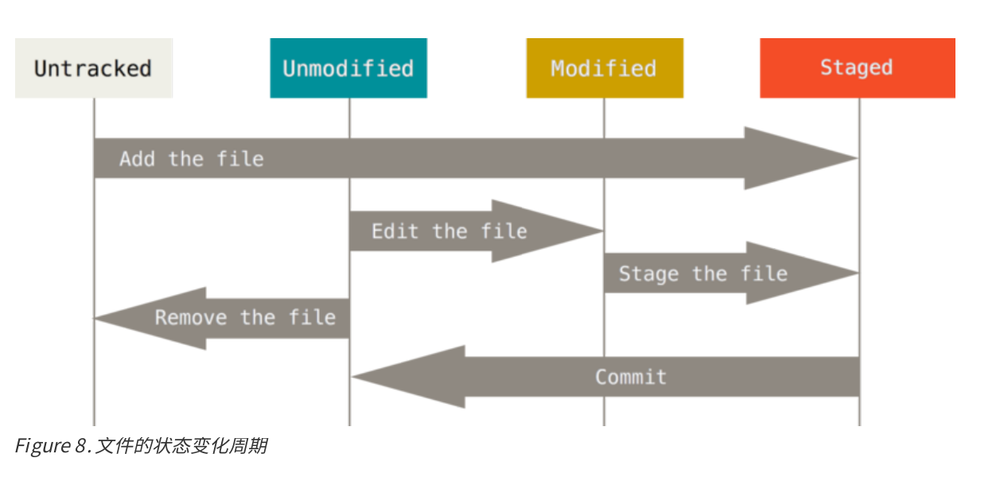
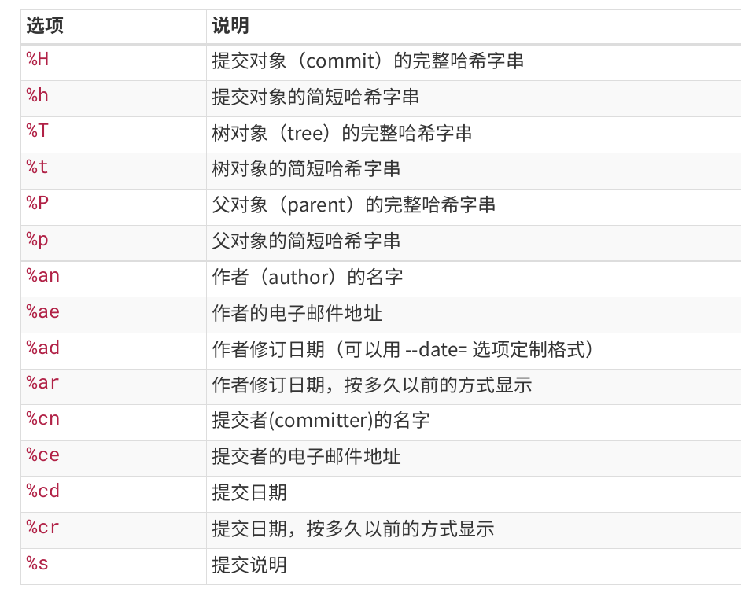

# Git

这是有关git的常用指令和学习内容记录

## Github仓库创建关联

### 方法一: GitHub上创建仓库然后克隆到本地直接关联

```bash
git clone https://github.com/zjremo/arch-linux.git
```

克隆到本地后其实就已经关联到了GitHub上的远程仓库

### 方法二: 本地先初始化本地仓库，然后关联远程仓库

```bash
# 假设我们的仓库目录是test/
cd test
# 初始化git本地仓库
git init
# 添加README.md或者全部东西
git add README.md
# 或者
git add .
# 第一次本地提交
git commit -m "first commit"
# 变更master分支为main分支
git branch -M main
# 关联远程仓库
git remote add origin https://github.com/zjremo/test.git
# 推送到远程仓库，-u表示默认记忆推送到后面写的分支(比如此时就是main)
git push -u origin main
```

## 具体的相关重要知识

### 信息初始化

当安装完`Git`应该做的第一件事就是设置你的用户名称与邮件地址。这样做很重要，因为每一个`Git`的提交都会使用这些信息，并且它会写入到你的每一次提交中，不可更改：

```bash
git config --global user.name "John Doe"
git config --global user.email johndoe@example.com
```

使用`--global`选项之后，命令只需要运行一次即可。后面Git提交都会选择这些信息。

```bash
# 查看所有设置的配置
git config --list
http.proxy=http://127.0.0.1:15732
https.proxy=http://127.0.0.1:15732
user.email=3106316195@qq.com
user.name=zjremo

git config user.name
zjremo
```

### 记录每次更新到仓库

#### 文件状态


每一个文件都不外乎这两种状态：已跟踪或未跟踪。已跟踪的文件是指那些被纳入了版本控制的文件，在上一次快照中有它们的记录，在工作一段时间后，它们的状态可能处于未修改，已修改或已放入暂存区。工作目录中除已跟踪文件以外的所有其它文件都属于未跟踪文件，它们既不存在于上次快照的记录
中，也没有放入暂存区。初次克隆某个仓库的时候，工作目录中的所有文件都属于已跟踪文件，并处于未修改状
态。编辑过某些文件之后，由于自上次提交后你对它们做了修改，Git 将它们标记为已修改文件。我们逐步将这些修
改过的文件放入暂存区，然后提交所有暂存了的修改，如此反复。

#### 检查当前文件状态

`git status`命令输出十分详细，但其用于比较繁琐，其实可以使用`git status -s`来简化，从而获取更为紧凑的格式输出。

```bash
$ git status -s
M README
MM Rakefile
A lib/git.rb
M lib/simplegit.rb
?? LICENSE.txt
```

其中上面的符号为含义:

```text
1. ??: 目前文件添加之后没有跟踪；
2. _M: 文件被修改但是没有放入暂存区；
3. M_: 文件被修改了并放入暂存区；
4. A: 新添加到暂存区中的文件前面有A标记.
```

### 忽略文件

我们可以创建一个名为.gitignore的文件列出需要忽略的文件模式.

```bash
$ cat .gitignore
*.[oa]
*~
```

如上便是告诉Git忽略所有以.o或者.a结尾的文件。第二行的告诉Git忽略所有以(~)结尾的文件。
文件`.gitignore`的格式规范简单来说就是支持正则表达式

如下以常用的例子来说明.gitignore中的一些用法:

```.gitignore
# no .a files
*.a
# but do track lib.a, even though you're ignoring .a files above
!lib.a
# only ignore the TODO file in the current directory, not subdir/TODO
/TODO
# ignore all files in the build/ directory
build/
# ignore doc/notes.txt, but not doc/server/arch.txt
doc/*.txt
# ignore all .pdf files in the doc/ directory
doc/**/*.pdf
# ignore directories ending with 'hello' only in the root directory
/*hello/
# ignore directories ending with 'test' at any depth in the project
**/*test/
# ignore directories ending with 'idea' exactly three levels deep (e.g., /a/b/c_idea/)
/*/*/*idea/
```

`.gitignore`文件可以参考: <https://github.com/github/gitignore>

### 查看已暂存和未暂存的修改

```bash
# 查看工作区的修改，也就是没有暂存的修改
git diff
# 查看暂存区的修改，也就是已经暂存的修改
git diff --cached
```

### 跳过使用暂存区域

```bash
# 为了避免繁琐的git add, 可以直接给git commit加上-a选项
# 此时Git会自动把所有已经跟踪过的文件暂存起来一并提交
git commit -a
```

### 移除文件

从`Git`中移除某个文件，就必须要从已经跟踪文件清单中移除(其实就是暂存区)，然后提交。

运行`git rm`命令不仅会从暂存区移除，还会将工作区的文件给删除掉。

当我们只想把文件从`Git`仓库中移除，但仍然希望保留在当前工作目录中时，此时需要用到`git rm --cached file`

### 移动文件

```bash
git mv file_from file_to
```

其实如上的命令相当于依次运行下面三条命令:

```bash
mv README.md README
git rm README.md
git add README
```

## 查看提交历史

查看提交历史的命令一般采取`git log`命令，其中还有许多选项来帮助你搜寻所要找的提交。

```bash
# -p选项显示每次提交的内容差异，加上-2仅仅显示最近的两次提交
$ git log -p -2

# --stat 想查看每次提交的简略统计信息
$ git log --stat          
commit 6d6d5c1cbc5a38388dc276f580cd5448c9892861 (HEAD -> main, origin
/main, origin/HEAD)
Author: zjremo <3106316195@qq.com>
Date:   Tue Jan 27 17:24:08 2026 +0800

    update: IDEA关闭标签页适用范围增加

 Java/IDEA/IDEA.md | 2 +-
 1 file changed, 1 insertion(+), 1 deletion(-)
# --pretty选项来指定按照不同格式来展示提交历史
# oneline将每个提交放到一行
$ git log --pretty=oneline
6d6d5c1cbc5a38388dc276f580cd5448c9892861 (HEAD -> main, origin/main, 
origin/HEAD) update: IDEA关闭标签页适用范围增加
62fc085dad1677cb6bd9ae45e651a4303f7e6857 update: IDEA快捷键添加
38a4ab89694003a0c449de8ef22dd0f3b525cb3a update: git部分的内容
2ce152a1340c2d5ca39e68baf9e4ef28c75d6a23 upload: 初始化git内容部分，
提交部分学习信息

# format可以定制记录格式
$ git log --pretty=format: "%h - %an, %ar : %s"
ca82a6d - Scott Chacon, 6 years ago : changed the version number
085bb3b - Scott Chacon, 6 years ago : removed unnecessary test
a11bef0 - Scott Chacon, 6 years ago : first commit

# 经常format配合--graph来使用显示图的模式
git log --pretty=format:"%h %s" --graph
```



## 撤销操作

### 提交压缩

适用情况: 1. 一次提交到本地仓库有遗漏，有些东西没有暂存; 2. 将本次少量的提交内容压缩到前一次提交。

下面是一个演示例子，我创建了两个文件，分别为`1.txt`和`2.txt`，本来想将其作为第一个提交，可是我第一次只跟踪暂存了`1.txt`

```bash
$ echo "hello, 1.txt">1.txt

$ echo "hello, 2.txt">2.txt

$ git add 1.txt

$ git commit -m"first commit"

$ git status -s
?? 2.txt

$ git add 2.txt

# 此时将本次压缩至上一次提交, 并且将提交信息修改
$ git commit --amend
[main f09a1ba] initial commit, now is 1.txt and 2.txt
 Date: Wed Jan 28 00:15:12 2026 +0800
 2 files changed, 2 insertions(+)
 create mode 100644 1.txt
 create mode 100644 2.txt

$ git log --pretty=format:"%h %s" --graph
* f09a1ba initial commit, now is 1.txt and 2.txt
```

### 取消暂存的文件

有时为了每次提交都只提交相应模块的内容，做到方便管理。但是可能中途我只想提交`1.txt`结果却还提交了`2.txt`。此时就可以使用`git reset`命令来取消对某个文件的暂存。

```bash
$ git add 1.txt 2.txt

$ git reset HEAD 2.txt

$ git status -s
M  1.txt
 M 2.txt

```

### 撤销对文件的修改

我们紧接着上面的讨论，如果我此时想撤销掉工作区中对`2.txt`的修改，将其还原为上次提交完的内容。此时可以使用`git checkout`命令

```bash
# 此时执行完后2.txt会被还原为上个版本的内容
$ git checkout -- 2.txt
```

## 远程仓库的使用

### 查看远程仓库

```bash
# 显示远程仓库使用的Git保存的简写和其对应的URL
$ git remote -v
origin https://github.com/zjremo/OrdinaryRoad.git (fetch)
origin https://github.com/zjremo/OrdinaryRoad.git (push)
```

### 添加远程仓库

添加远程仓库的命令是`git remote add <shortname> <url>`，其中`url`是远程的Git仓库地址，`shortname`是指定的一个可以轻松引用的简写。

```bash
$ git remote
origin
$ git remote add pb https://github.com/paulboone/ticgit
$ git remote -v
originhttps://github.com/schacon/ticgit (fetch)
originhttps://github.com/schacon/ticgit (push)
pbhttps://github.com/paulboone/ticgit (fetch)
pbhttps://github.com/paulboone/ticgit (push)
```

### 从远程仓库中抓取与拉取

从远程仓库中获取数据，可以执行:

```bash
git fetch [remote-name]
```

这个命令会访问远程仓库，从中拉取所有还没有的数据。执行完成后，你将会拥有那个远程仓库中所有分支的引用，可以随时合并或查看。

如果使用`clone`命令克隆了一个仓库，命令会自动将添加为远程仓库并默认以"origin"为简写。使用`git fetch origin`会抓取克隆后新推送的所有工作。此时不会自动合并或修改当前的工作，必须手动合并入工作。

`git pull`命令来自动的抓取然后合并远程分支到当前分支。

### 推送到远程仓库

推送命令采用`git push [remote-name] [branch-name]`，当想要将`master`分支推送到`origin`服务器时，那么运行这个命令就可以将所做的修改备份到服务器:

```bash
git push origin master
```

### 查看远程仓库

如果想要查看某一个远程仓库的更多信息，可以使用`git remote show [remote-name]`命令。

```bash
$ git remote show origin
* remote origin
Fetch URL: https://github.com/schacon/ticgit
Push URL: https://github.com/schacon/ticgit
HEAD branch: master
Remote branches:
master
 tracked
dev-branch
 tracked
Local branch configured for 'git pull':
master merges with remote master
Local ref configured for 'git push':
master pushes to master (up to date)
```

### 远程仓库的移除与重命名

如果想要重命名引用的名字可以运行`git remote rename`去修改一个远程仓库的简写名。比如我之前添加了一个`https://github.com/paulboone/ticgit`远程仓库，引用设置为了`pb`，此时我想要修改为paul

```bash
$ git rename pb paul
$ git remote
origin
paul
```

如果我要移除一个远程仓库，直接使用`git remote rm <shortname>`

```bash
$ git remote rm paul
$ git remote
origin
```

## 重要的版本管理指令

| Command   | function    |
|--------------- | --------------- |
| git add file   | add untracked file or unstaged changes   |
| git add .   | add all untracked files and unstaged changes |
| git rm file   | delete file   |
| git rm --cached file   | 不再track这个file，同时工作区不删除这个file   |
| git reset file   | Unstage one file   |
| git branch    | List branches   |
| git branch -d branch_name   |  删除某个分支  |
| git branch -D branch_name   |  强制删除某个分支  |
