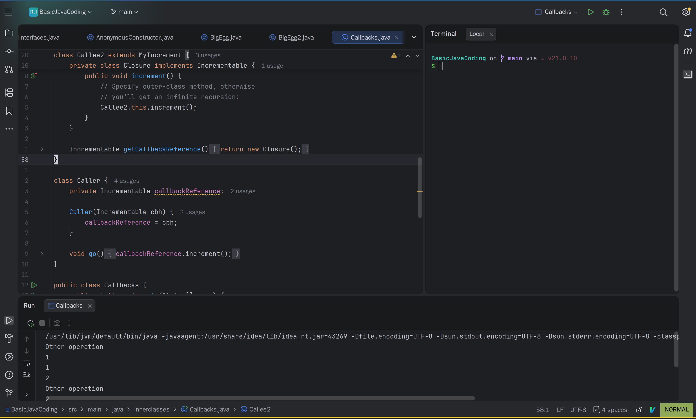

# IDEA使用方法

这是本人在使用`Java IDE`时的技巧记录。

## 快捷键

这是一个IDE我觉得最重要的部分，只有熟记快捷键才能够很好地提升开发效率。如果一直用鼠标无疑是极其痛苦的。

### 核心导航和搜索类

| key | function |
| -------------- | --------------- |
| Shift + Shift | 万能搜索，可以搜索项目中任何文件、类和文字等 |
| Ctrl + B | 跳转到变量/方法的定义处 |
| Alt + F7 | 查找该类/方法在全项目哪里被使用了 |

如上其实还有快速搜索并打开类Class的快捷键(Ctrl + N)、快速搜索并打开文件的快捷键(Ctrl + Shift + N)等。但是这个其实只用记一个Shift + Shift就行了，因为按Tab键可以选择到底是搜啥东西(Text? Class? Files?)

### 代码编写与重构

| key   | function    |
|--------------- | --------------- |
| Alt + Enter   | 万能修正。自动导包、修复错误、代码改进建议   |
| Ctrl + Alt + L   | 格式化代码   |
| Ctrl + /   | 单行注释/取消注释   |
| Ctrl + Shift + /   | 块注释/取消注释   |
| Shift + F6   | 在一个文件中同步修改所有引用的地方   |
| Ctrl + Alt + v   | 自动提取变量。比如把new Person()变成Person person = new Person()   |
| Alt + Insert   | 在Java类中Generate一些方法等东西   |

比较常用的就是万能修正、格式化代码，同步修改可以在文件中快速适配所有同类项来进行同步修改。在Java类中的方法创建和覆写完全可以利用`Alt + Insert`来快速完成。

### 构建与调试

| key | function |
| -------------- | --------------- |
| Shift + F10 | 构建项目 |
| Ctrl + Shift + F10 | 运行Java类main方法 |
| F8 | 步过 |
| F7 | 步入 |

### 窗口管理

| key   | function    |
|--------------- | --------------- |
| Alt + 1   | 快速打开/关闭项目树   |
| Ctrl + F4   | 关闭当前标签页   |
| Alt + 4   | 打开构建窗口   |
| Alt + F12   | 打开终端界面   |

最后个人比较喜爱的一个窗口布局：



### 特殊注意

```Text
1. 如果要对一个文件夹下许多个文件格式化代码，可以直接光标放在项目树的文件夹上，然后Ctrl + Alt + L便可以对这个文件夹下的所有文件都格式化代码;
2. IDEA有个很恶心的快捷键Esc，就是光标如果在终端时按下Esc会跳至工作区，其实这是个很无语的用途。建议打开设置中的keymap进行快捷键删除;
```

## 插件

本部分介绍IDEA应该安装的一些插件。

### Vim

Vim的编辑方式是极其丝滑流畅的，键盘友好，所以安装Vim插件是很好的。

由于我是`Arch Linux`系统，自己已经在`~/.vimrc`中对系统Vim进行了配置，所以直接在插件里面直接配置使用系统Vim的配置即可。最终在`~/.ideavimrc`中体现为:

```bash
source ~/.vimrc
```

本人的`~/.vimrc`配置为:

```bash
" 启用系统剪贴板
set clipboard=unnamedplus

" 显示行号
set number
set relativenumber

" 高亮搜索
set hlsearch

" 语法高亮
syntax on

" 自动缩进
set autoindent
set smartindent

" 高亮当前行
set cursorline

" 智能缩进
set shiftwidth=4
set tabstop=4

" 插入模式下 Ctrl-a 跳到行首
inoremap <C-a> <Esc>I

" 插入模式下 Ctrl-e 跳到行尾
inoremap <C-e> <Esc>A

" 普通模式下 Ctrl-a 跳到行首
nnoremap <C-a> ^

" 普通模式下 Ctrl-e 跳到行尾
nnoremap <C-e> $
" 可视模式下 Ctrl-a 跳到行首
vnoremap <C-a> ^
" 可视模式下 Ctrl-e 跳到行尾
vnoremap <C-e> $

" 搜索时不区分大小写
set ignorecase

" 搜索中出现大写字母，区分大小写
set smartcase
```
