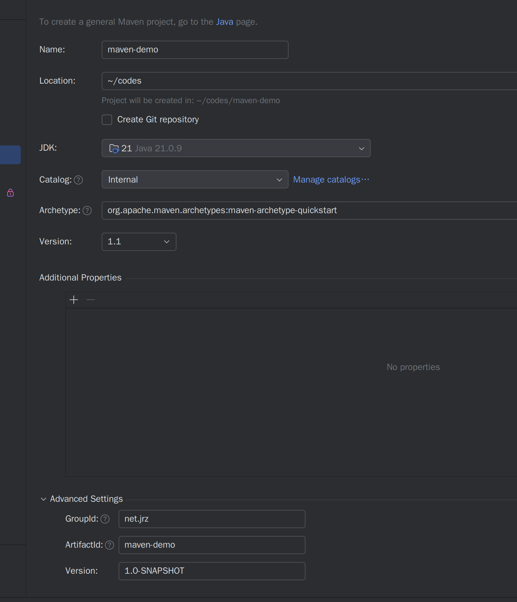
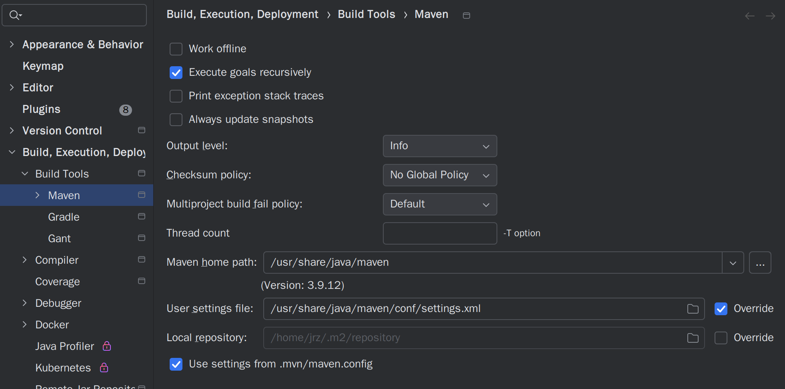
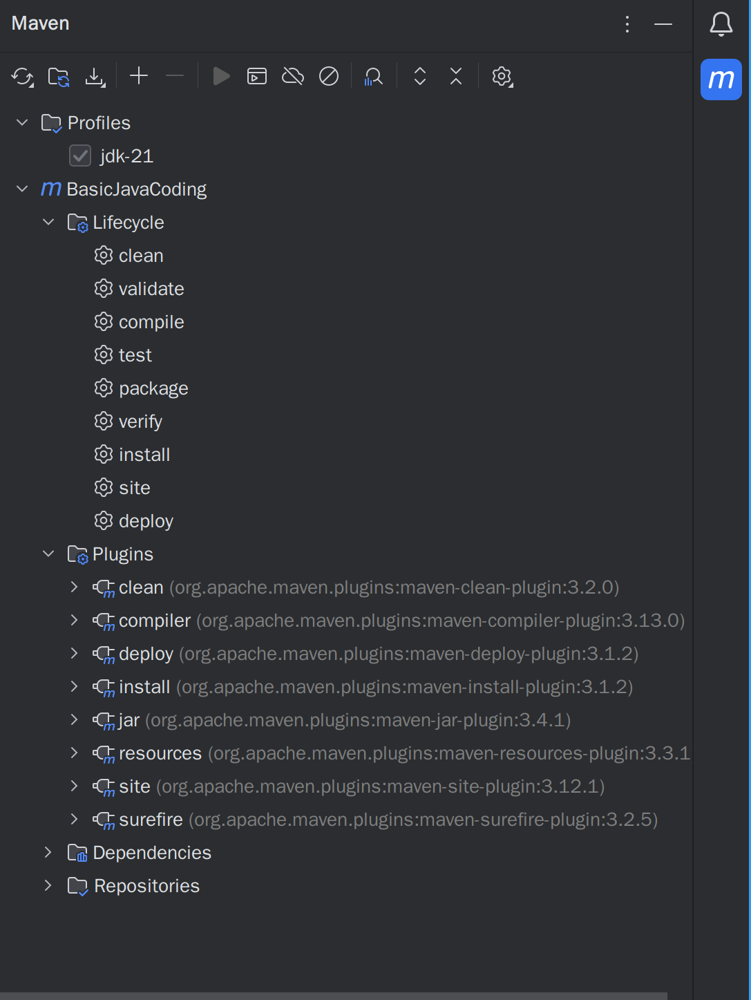

# Maven使用笔记(以Arch Linux为例)

Maven用于解决Java的依赖问题，本人更喜欢Maven而不是gradle

## 安装步骤

### 下载maven

没有Java的先安装Java：

```bash
sudo pacman -S jdk21-openjdk
```

maven直接使用如下命令安装:

```bash
sudo pacman -S maven
```

经过如上命令安装之后会在home目录下生成`.mvn`文件夹，一般里面作为本地仓库的存放地；本身`maven`文件夹存放在`/usr/share/java/maven`中。

### 配置调整

在上面所提到的maven文件夹下的`conf`目录下有一个`settings.xml`文件，我们对里面的配置进行调整，主要是两个方面：

- 换源，换为国内镜像源(比如阿里云):

```text
找到<mirrors>标签处，在内部添加国内镜像源，最终内部为：
  <mirrors>
    <mirror>
      <id>maven-default-http-blocker</id>
      <mirrorOf>external:http:*</mirrorOf>
      <name>Pseudo repository to mirror external repositories initially using HTTP.</name>
      <url>http://0.0.0.0/</url>
      <blocked>true</blocked>
    </mirror>
    <mirror>
      <id>aliyunmaven</id>
      <mirrorOf>*</mirrorOf>
      <name>aliyunrepository</name>
      <url>https://maven.aliyun.com/repository/public</url>
    </mirror>
  </mirrors>
其中上面的mirrorOf处设置为*，可以让所有的下载都先使用国内镜像源。

```

- 添加profile，设置为系统安装的jdk，以jdk21为例：

```text
找到<profiles>标签处，在内部添加自己系统安装的jdk，以jdk21为例：
    <profile>
      <id>jdk-21</id>
      <activation>
      <activeByDefault>true</activeByDefault>
        <jdk>21</jdk>
      </activation>
      <properties>
        <maven.compiler.source>21</maven.compiler.source>
        <maven.compiler.target>21</maven.compiler.target>
        <maven.compiler.compilerVersion>21</maven.compiler.compilerVersion>
      </properties>
    </profile>
```

## IDEA中相关设置

我们以在IDEA中创建一个maven项目并完成基本的生命周期为例，具体来进行相关的解释。

### maven项目创建：
在IDEA中点击创建一个maven项目，然后如图设置:

在此界面会选择JDK，然后创建的模式有很多种，一般直接无脑选`quickstart`即可，这个创建的是最标准的maven项目格式。

### maven构建器设置
此时虽然创建了maven项目，但是此时我们需要调整maven构建器的设置，来使用自己已经安装好的maven、maven配置以及本地仓库。


如上便是：使用自己的maven；自己的maven配置；自己设置的本地仓库。

### maven生命周期命令使用
IDEA右侧会有一个maven图标，我们点击之后便可以看到：

其中Profiles显示了一个profile，叫作jdk-21，这个是我们刚刚事先配置的；然后下面的Lifecycle便是生命周期，对应的命令执行都是靠下面Plugins的相关插件。
