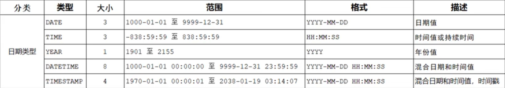
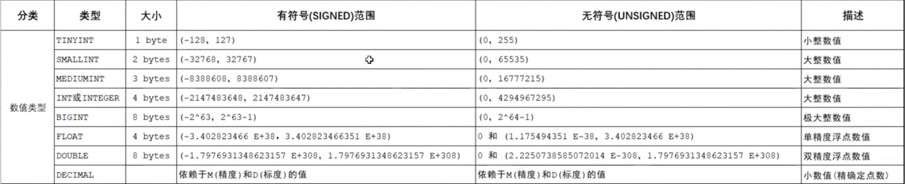
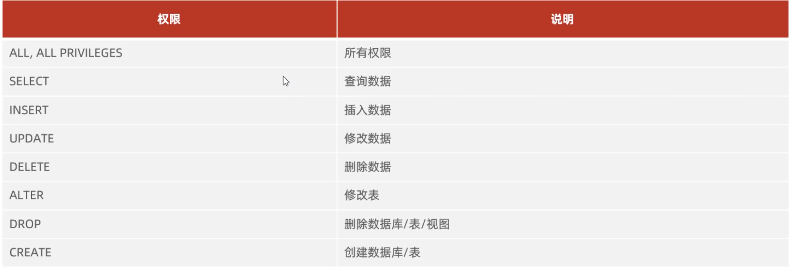
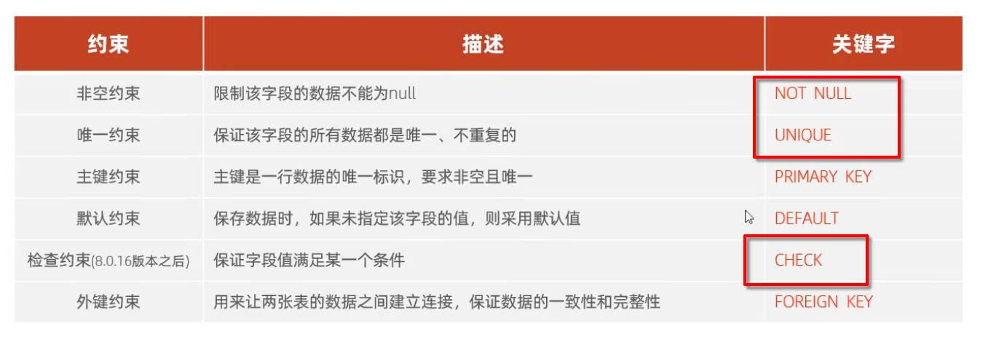
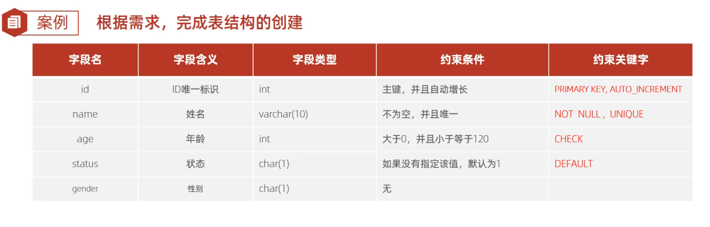
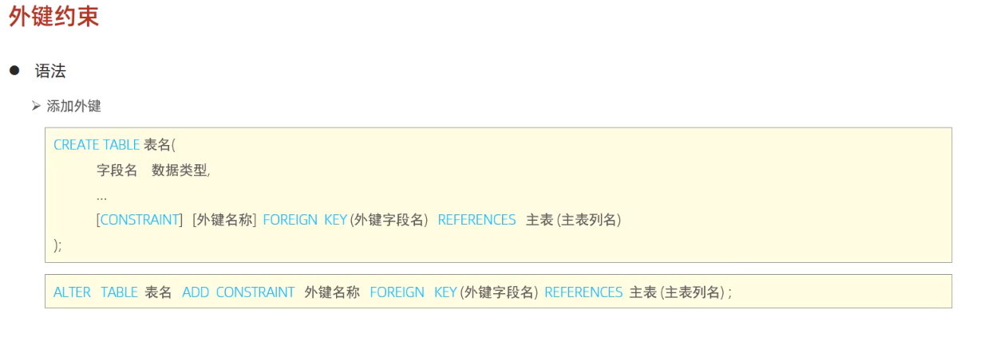

# MySQL数据库相关知识

## 安装方法

由于本人是Linux环境，加上安装了docker，于是我决定采用docker来安装MySQL。

```bash
# 拉取MySQL镜像，这里拉取指定版本号的8.0版本
$ docker pull mysql:8.0
# 运行Mysql容器
$ docker run -itd --name mysql-test -p 3306:3306 -e MYSQL_ROOT_PASSWORD=123456 mysql:8.0
```

运行完之后，通过vscode的docker插件进行连接，在容器终端里面使用:

```bash
mysql [-h 127.0.0.1] [-P 3306] -u root -p
```

## 具体知识

### SQL

建议事项:

- MySQL数据库的SQL语句不区分大小写，关键词建议使用大写;
- SQL语句可以单行或多行书写，以分号结尾

#### DDL

数据库操作：

```text
1. 查询:
1.1 查询所有数据库: 
SHOW DATABASES;
1.2 查询当前数据库:
SELECT DATABASE();
2. 创建:
CREATE DATABASE [IF NOT EXISTS] 数据库名 [DEFAULT CHARSET 字符集] [COLLATE 排序规则];
3. 删除:
DROP DATABASE [IF EXISTS] 数据库名;
4. 使用:
USE 数据库名;
```

表操作-查询与创建：

```text
1. 查询当前数据库所有表:
SHOW TABLES;
2. 查询表结构:
DESC 表名;
3. 查询指定表的建表语句:
SHOW CREATE TABLE 表名;

4. 创建表:
CREATE TABLE 表名{
    字段1 字段1类型[COMMENT 字段1注释],
    字段2 字段2类型[COMMENT 字段2注释],
    字段3 字段3类型[COMMENT 字段3注释],
    ...
    字段n 字段n类型[COMMENT 字段n注释]
}[COMMENT 表注释];
```

数据类型:

```text
VARCHAR和CHAR的选取: 
VARCHAR是变长的，CHAR是定长的。VARCHAR的性能会弱于CHAR。一般定长的我们可以选取CHAR(比如说性别)，变长的选择VARCHAR(比如说用户名)。
```



其中一定要非常注意`TIMESTAMP`的范围最终到2038年，尽量不要使用这个数据类型，避免系统崩溃。



如果要使用无符号类型，就直接在后面加上`unsigned`即可。

表操作-修改:

```text
1. 添加字段: 
ALTER TABLE 表名 ADD 字段名 类型(长度) [COMMENT注释] [约束]; 
2. 修改数据类型:
ALTER TABLE 表名 MODIFY 字段名 新数据类型(长度);
3. 修改字段名和字段类型:
ALTER TABLE 表名 CHANGE 旧字段名 新字段名 类型(长度) [COMMENT 注释] [约束]
4. 删除字段: 
ALTER TABLE 表名 DROP 字段名;
5. 修改表名:
ALTER TABLE 表名 RENAME TO 新表名;
6. 删除表:
DROP TABLE [IF EXISTS] 表名;
7. 删除指定表，并重新创建表:
TRUNCATE TABLE 表名;
```

#### DML

添加数据:

```text
在这里只说明比较常使用的语句：
INSERT INTO 表名(字段名1, 字段名2, ...) VALUES (值1, 值2,...), (值1, 值2, ...);
INSERT INTO 表名 VALUES (值1, 值2,...), (值1, 值2, ...);

更新表:
UPDATE 表名 set 字段名1 = 值1, 字段名2 = 值2 where 条件;
```

#### DQL

```text
DQL语法:
SELECT 字段1[AS 别名1], 字段2[AS 别名2] ... FROM 表名 WHERE 条件 GROUP BY 分组字段列表 HAVING 分组后条件列表 ORDER BY 排序字段列表 LIMIT 分页参数
```

上面的`DQL`的执行顺序：
FROM -> WHERE -> GROUP BY -> HAVING -> SELECT -> ORDER BY -> LIMIT

#### DCL

管理用户: 确定一个USER需要通过用户名@主机来确定。

```text
1. 查询用户
USE mysql;
SELECT * FROM user;

2. 创建用户
CREATE USER '用户名'@'主机名' IDENTIFIED by '密码';
比如我要创建一个可以在任意主机访问数据库的用户:
CREATE USER '用户名'@'%' IDENTIFIED by '密码';

3. 修改用户密码
ALTER USER '用户名'@'主机名' IDENTIFIED WITH mysql_native_password BY '新密码';

4. 删除用户
DROP USER '用户名'@'主机名';
```



```text
1. 查询权限:
SHOW GRANTS FOR '用户名'@'主机名';
2. 授予权限:
GRANT 权限列表 ON 数据库名.表名 TO '用户名'@'主机名';
3. 撤销权限:
REVOKE 权限列表 ON 数据库名.表名 FROM '用户名'@'主机名';
```

### 函数

#### 字符串函数

常见的字符串函数如下:

```text
1. 字符串拼接: concat("hello", " mysql")
2. 字符串转大写: upper("hello")
3. 字符串转小写: lower("HELLO")
4. 左填充: lpad("01", 5, '-') -> ---01
5. 右填充: rpad("01", 5, '-') -> 01---
6. 去除首位空格: trim(" hello   mysql ") ->  hello   mysql  
7. 子串: SUBSTRING("hello mysql", 3, 5) -> llo m   第一个3是pos(MySQL中的字符串索引从1开始, 5是多长的字符串)
8. 字符串长度: LENGTH("hello")
```

#### 数值函数

常见的数值函数如下:

```text
1. 向上取整: CEIL(5/3)
2. 向下取整: FLOOR(5/3)
3. 返回模: MOD(x, y)
4. 返回0~1内的随机数: RAND()
5. ROUND(x, y): 求参数x的四舍五入的值，保留y位小数
```

#### 日期函数

常见的日期函数如下:

```text
1. 当前日期: CURDATE() -> 2026-01-30;
2. 当前时间: CURTIME() -> 17:44:48
3. 显示当前日期与时间: NOW() -> 2026-01-30 17:44:48
4. 分别显示年、月和日: YEAR(NOW()), MONTH(NOW()), DAY(NOW())
5. 添加日期: SELECT DATE_ADD(NOW(), INTERVAL 70 YEAR); 其中这个YEAR可以换为MONTH、DAY;
6. 日期相减: DATEDIFF("2021-12-01", "2021-10-01") -> 左边 - 右边 得到最后的天数(61)
```

#### 流程函数

感觉不咋用

### 约束

约束是作用在表中字段上的规则，用于限制存储在表中的数据。

一定要注意: 约束是作用在表中字段上的，可以在创建/修改表的时候添加约束。

#### 常见约束



如下是一个约束案例，其中展示了一些常见的约束:


```SQL
-- 创建上面案例的表
CREATE Table user (
    id INT PRIMARY KEY AUTO_INCREMENT COMMENT '主键',
    name VARCHAR(10) NOT NULL UNIQUE COMMENT '姓名',
    age INT check (age > 0 && age <= 120) COMMENT '年龄',
    status CHAR(1) DEFAULT '1' COMMENT '状态',
    gender CHAR(1) COMMENT '性别'
) COMMENT '用户表';
```

#### 外键约束

外键用来让两张表的数据之间建立连接，从而保证数据的一致性和完整性。

其中语法分为两类，一种是在建表时直接对字段进行外键约束指定，另一种是后面利用ALTER关键字来添加约束。


删除外键约束:

```SQL
ALTER Table emp drop FOREIGN KEY [定义的外键约束名];
```
