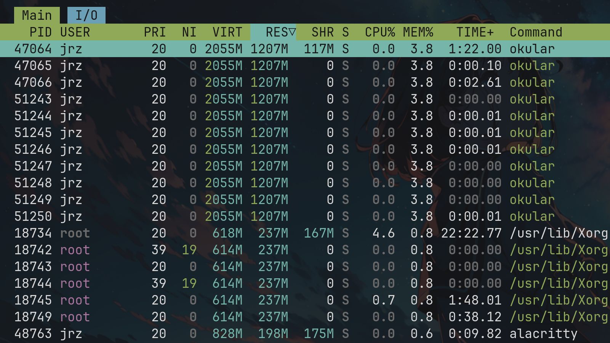

# Linux Shell脚本编程总结

本部分是对`Linux Shell`脚本编程的内容总结，里面包含了与脚本和`Shell Commands`相关的内容。

## 辅助工具

对于Shell编程的学习，主要采用以下工具进行辅助：

- `tldr`: 当遇到某个命令不会时，如果想要快速了解如何使用可以直接使用`tldr <command>`来进行查看;
- `man`: man手册是最为详细的内容，可以通过`man <command>`来进行查看，但是一般比较难读，仅限需要学习时才查看；
- `ShellCheck`: 可以对写的Shell脚本进行诊断，要求一般比较严格，命令为`shellcheck <file-name>`

## 文件操作

文件操作中基本的命令十分简单，分为以下部分：

```text
1. 目录遍历：ls cd ;
2. 文件处理:
    1.1 文件创建: mkdir touch;
    1.2 复制文件: cp;
    1.3 链接文件: ln, 其中ln data_file ln_datafile表示硬链接; ln -s data_file ln_datafile表示软链接
    1.4 重命名文件: 通常采用mv来实现，mv old_file new_file
    1.5 删除文件: rm, rmdir
```

基本就是采用以上的主命令实现，然后后面加上选项便可以实现许多功能。

## 程序监测

### 探查进程

我们常用的其实就是`ps -ef`这个命令，其中`-e`选项代表的是显示所有程序，`-f`选项代表的是显示完整格式的输出。

如下便是`ps -ef`的调用样例的部分输出:

```bash
$ ps -ef
UID          PID    PPID  C STIME TTY          TIME CMD
root           1       0  0 1月28 ?       00:00:03 /usr/lib/systemd/systemd --switched-root --system --deserialize=51 nowathcdog
root           2       0  0 1月28 ?       00:00:00 [kthreadd]
root           3       2  0 1月28 ?       00:00:00 [pool_workqueue_release]
root           4       2  0 1月28 ?       00:00:00 [kworker/R-rcu_gp]
root           5       2  0 1月28 ?       00:00:00 [kworker/R-sync_wq]
root           6       2  0 1月28 ?       00:00:00 [kworker/R-kvfree_rcu_reclaim]
root           7       2  0 1月28 ?       00:00:00 [kworker/R-slub_flushwq]
root           8       2  0 1月28 ?       00:00:00 [kworker/R-netns]
root          10       2  0 1月28 ?       00:00:00 [kworker/0:0H-events_highpri]
root          13       2  0 1月28 ?       00:00:00 [kworker/R-mm_percpu_wq]
root          15       2  0 1月28 ?       00:00:00 [ksoftirqd/0]
root          16       2  0 1月28 ?       00:00:18 [rcu_preempt]
root          17       2  0 1月28 ?       00:00:00 [rcub/0]
root          18       2  0 1月28 ?       00:00:00 [rcu_exp_par_gp_kthread_worker/0]
```

其中如上的列名代表的含义如下：

```text
UID: 启动进程的用户，其实就是进程的使用者；
PID: 进程的唯一标识ID;
PPID: 父进程的唯一标识ID;
C: 进程生命周期的中的CPU利用率；
STIME: 进程启动时的系统时间；
TTY: 进程启动时的终端设备；
TIME: 运行进程需要的累计CPU时间；
CMD: 启动的程序名称
```

### 监测进程

其实我们更经常用的是`htop`来监测进程，因为它的信息更全，且配置了高亮。



如上的列名代表的含义如下(仅仅说明和上面有所不同的地方)：

```text
PRI: 进程的优先级
NI: 进程的谦让度值，NI值越小，说明进程越不友好，越喜欢抢占更多的CPU时间，优先级越高；
VIRT: 进程占用的虚拟内存总量；
RES: 进程占用的物理内存总量；
SHR: 进程与其他进程共享的内存总量；
S: 进程的状态(D: 可中断的休眠状态；R: 在运行状态；S: 休眠状态；T: 跟踪状态或停止状态；Z: 僵化状态)
CPU%: 进程使用的CPU时间比例；
MEM%: 进程使用的内存占可用内存的比例；
TIME+：自进程启动到目前为止的CPU时间总量。
```

## 使用Linux环境变量

环境变量分为下面两类:

- 全局变量: 对于shell会话和所有生成的子shell都是可见的, 比如我们在`.zshrc`中利用`export`命令创建的环境变量
- 局部变量: 一旦启动了bash shell（或者执行一个shell脚本），就能创建在这个shell进程内可见的局部变量了。可以通过等号给环境变量赋值，值可以是数值或字符串

删除环境变量采用`unset`命令，比如`unset myvariable`

### 设置PATH环境变量

当在shell命令行输入一个外部命令时，shell必须搜索系统来找到对应的程序。PATH环境变量定义用于进行命令和程序查找的目录。比如我的`$PATH`如下:

```bash
$ echo $PATH
/home/jrz/.npm-global/bin:/home/jrz/.local/share/nvim/mason/bin:/usr/lib/jvm/java-21-openjdk/bin:/usr/local/sbin:/usr/local/bin:/usr/bin:/usr/lib/jvm/default/bin:/usr/bin/site_perl:/usr/bin/vendor_perl:/usr/bin/core_perl
```

如果命令或程序的位置没有包括在`PATH`变量中，那么不使用绝对路径的话，shell是没法找到的，如果shell找不到指定的命令或程序，会产生一个错误信息：

```bash
$ myprog
-bash: myprog: command not found
```

可以将新的搜索目录添加到现有的`PATH`环境变量中，无需从头定义：
比如我的`.zshrc`中是这样定义`Java`和`Mason`位置的:

```bash
# JAVA路径配置
export JAVA_HOME=/usr/lib/jvm/java-21-openjdk
export PATH=$JAVA_HOME/bin:$PATH

# Mason配置
export MASON="$HOME/.local/share/nvim/mason"
export PATH="$MASON/bin:$PATH"
```

## Linux文件权限

用户权限是通过创建用户时分配的用户ID（User ID，通常缩写为UID）来跟踪的。UID是数值，每个用户都有唯一的UID，但在登录系统时用的不是UID，而是登录名。登录名是用户用来登录系统的最长八字符的字符串（字符可以是数字或字母），同时会关联一个对应的密码。

### /etc/passwd文件

这里面相当于是系统的用户数据库，记录了每一个可以登录系统的用户（包括人类用户和系统服务进程）的基本信息。

```bash
$ cat /etc/passwd
root:x:0:0::/root:/usr/bin/bash
bin:x:1:1::/:/usr/bin/nologin
daemon:x:2:2::/:/usr/bin/nologin
mail:x:8:12::/var/spool/mail:/usr/bin/nologin
ftp:x:14:11::/srv/ftp:/usr/bin/nologin
http:x:33:33::/srv/http:/usr/bin/nologin
...
```

以上面的第一行为例进行说明：

```text
root:x:0:0::/root:/usr/bin/bash
每一个信息由:进行分隔，自左向右代表:
1. 用户名: root;
2. 密码占位符: x。以前这里存的是加密密码，现在为了安全，密码存放在/etc/shadow中，这里用x代替;
3. UID: 用户ID。系统内部通过数字识别用户。0 永远代表超级管理员 root;
4. GID: 组ID。对应的是/etc/group中的主用户组编号；
5. 用户信息: 空。用户的备注信息，一般是空的；
6. home目录: 用户登录后的默认工作目录，比如此时root用户的就是/root；
7. 登录shell: 用户登录后使用的命令行解释器。比如此时就是/usr/bin/bash。
```

### /etc/shadow文件

上面提到的密码存放在这个位置，其实只能root用户才能访问这个文件。
一般格式如下:

```bash
rich:$1$.FfcK0ns$f1UgiyHQ25wrB/hykCn020:11627:0:99999:7:::
```

上面的第二段东西就是加密后的密码。
